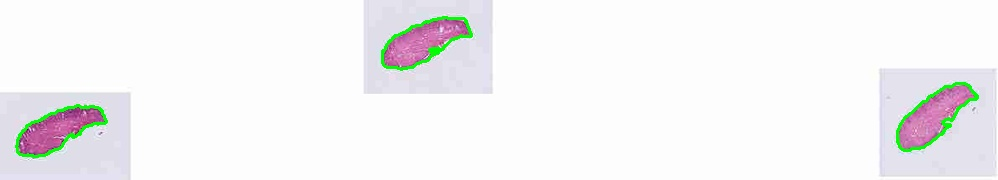
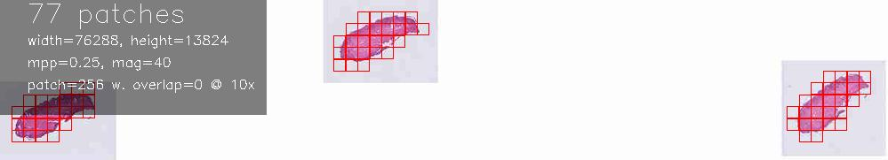
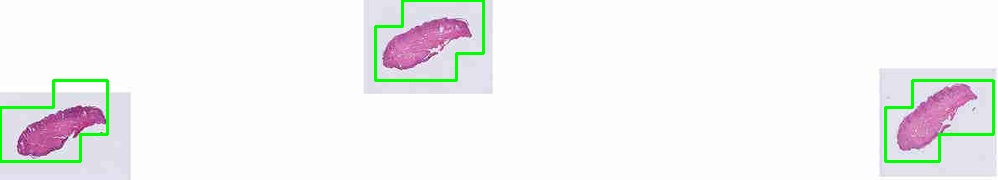
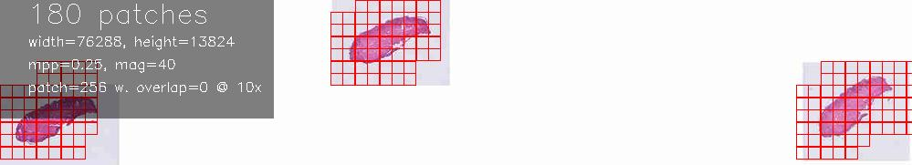
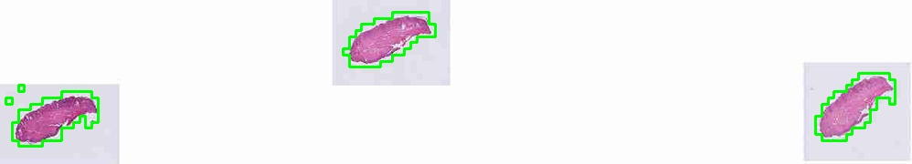
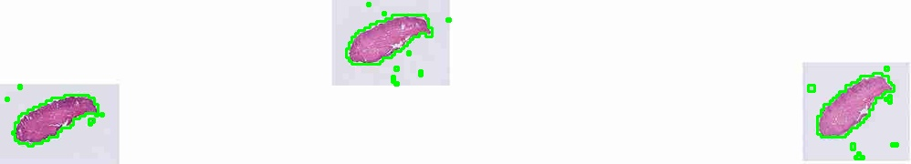
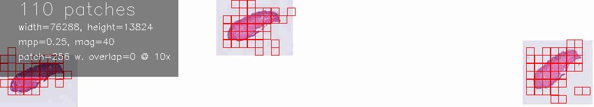

# LeNet5 Segmentation Model Integration

## Overview

This document describes the integration of the LeNet5 segmentation model from the [Tissue-region-segmentation-in-HE-and-IHC-stained-pathology-slides](https://github.com/sepidehnaghshineh/Tissue-region-segmentation-in-HE-and-IHC-stained-pathology-slides) project into the TRIDENT framework.

## Citation

```bibtex
@software{naghshineh_kani_2024,
  author = {Naghshineh Kani, Sepideh and Soyak, Burak Can and Gokce, Melih and Duyar, Zeynep and Alicikus, Hasan and Yapıcıer, Özlem and Öner, Mustafa Ümit},
  title = {Tissue-region-segmentation-in-HE-and-IHC-stained-pathology-slides-of-specimens-from-different-origins},
  version = {1.0.0},
  year = {2024},
  url = {https://github.com/sepidehnaghshineh/Tissue-region-segmentation-in-HE-and-IHC-stained-pathology-slides},
  doi = {10.5281/zenodo.1234}
}
```

## Model Description

**LeNet5Segmenter** is a patch-based tissue segmentation model that uses a sliding window approach to classify image patches as tissue or background. Unlike pixel-level segmentation models (HEST, GrandQC), LeNet5 processes 128×128 pixel patches and uses majority voting to create the final segmentation mask.

### Key Characteristics

- **Architecture**: LeNet5 CNN (128×128 input)
- **Approach**: Patch-level classification with sliding window inference
- **Classes**: Binary (background=0, tissue=1)
- **Normalization**: Custom values from original training
  - Means: [0.434, 0.413, 0.431]
  - Stds: [0.067, 0.074, 0.066]

## Performance Benchmarking

We conducted a comprehensive resolution vs performance analysis on a sample H&E slide to determine the optimal operating parameters.

### Benchmark Results

| Model                | Target Mag | Resolution     | Time (s) |
| -------------------- | ---------- | -------------- | -------- |
| **HEST (baseline)**  | 10         | 1.00 µm/px     | 11.1     |
| LeNet5               | 2.5        | 4.00 µm/px     | 4.7      |
| LeNet5               | 5          | 2.00 µm/px     | 5.7      |
| LeNet5               | 10         | 1.00 µm/px     | 9.1      |
| LeNet5               | 15         | 0.67 µm/px     | 12.3     |
| **LeNet5 (optimal)** | **20**     | **0.50 µm/px** | **18.8** |

### Key Findings

1. **Optimal Configuration**: `target_mag = 20` (0.50 µm/pixel resolution)
2. **Trade-off**: ~1.7× slower than HEST but superior boundary precision
3. **Resolution Sensitivity**: Lower resolutions (target_mag < 10) produce overly coarse segmentation
4. **Performance**: Processing time scales roughly linearly with resolution

## Integration Details

### Factory Integration

LeNet5 is integrated into the segmentation model factory and can be instantiated as:

```python
from trident.segmentation_models import segmentation_model_factory

model = segmentation_model_factory('lenet5')
```

### CLI Usage

LeNet5 is available in both TRIDENT processing scripts:

```bash
# Single slide processing
python run_single_slide.py --segmenter lenet5 --slide_path slide.svs --job_dir output/

# Batch processing
python run_batch_of_slides.py --segmenter lenet5 --wsi_dir slides/ --job_dir output/
```

### Model Configuration

The model is configured with optimal parameters based on benchmarking:

```python
class LeNet5Segmenter(SegmentationModel):
    def __init__(self, input_size=128, **build_kwargs):
        # Sliding window: 128×128 patches
        # Stride: 16 pixels (matches original implementation)
        # Target magnification: 20× (0.50 µm/pixel resolution)
        # Confidence threshold: 0.5 (configurable via CLI)
```

## Technical Implementation

### Sliding Window Inference

LeNet5 uses a sophisticated sliding window approach:

1. **Patch Extraction**: 128×128 patches with 16-pixel stride
2. **Batch Processing**: Efficient GPU utilization with configurable batch size
3. **Majority Voting**: Conservative threshold (>60% patches must vote "tissue")
4. **Edge Handling**: Proper handling of image boundaries and overlapping regions

### Key Differences from Original

| Aspect                | Original Implementation | TRIDENT Integration                     |
| --------------------- | ----------------------- | --------------------------------------- |
| **Framework**         | Standalone script       | Integrated into TRIDENT pipeline        |
| **Resolution**        | Fixed 4 µm/pixel        | Configurable, optimized to 0.5 µm/pixel |
| **Voting**            | Complex weighted voting | Simplified majority voting              |
| **Batch Processing**  | Sequential              | GPU-optimized batching                  |
| **Memory Management** | Basic                   | TRIDENT's efficient memory handling     |

## Visual Results

### Segmentation Quality Comparison

The following images demonstrate the segmentation quality at different resolutions:

#### HEST Baseline (Target Mag 10, 1.00 µm/px)




- **Processing Time**: 11.1 seconds

#### LeNet5 Target Mag 2.5 (4.00 µm/px)




- **Processing Time**: 4.7 seconds

#### LeNet5 Target Mag 10 (1.00 µm/px)



- **Processing Time**: 9.1 seconds

#### LeNet5 Target Mag 20 (0.50 µm/px)




- **Processing Time**: 18.8 seconds

## Installation and Setup

### Prerequisites

1. LeNet5 model weights in local checkpoint registry:

   ```json
   {
     "LeNet5": "path/to/LeNet5Segmentation.pth"
   }
   ```

## References

1. Original LeNet5 tissue segmentation implementation
2. TRIDENT framework documentation
3. Benchmark analysis results (this integration)

---

_LeNet5 integration completed as part of TRIDENT segmentation model expansion - October 2025_
